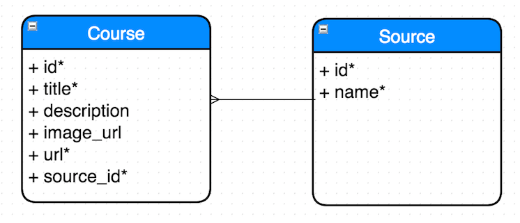

  

October 30, 2014:

I understand the requirements as follows:
- I need a place to collect matlab and simulink courses offered around the world
- I need a form to enter the following:
  - Course Title (required)
  - Course Description
  - Course Image URL
  - Course URL (coursera url, edx url, etc.) (required)
  - Course Source (does it come from coursera, edx or elsewhere) (required)
  title and URL and source required, description doesn't have to exist
- I must be able to save the course after entering its details in a form
- If I click on a course card, I see a single course view
- I should have the ability to search for a course, which will return all courses that fit a particular search query in a card layout format (see matlab examples to do this)
- Code should be testable

Course Table:

October 31, 2014:

- Added rails framework
- Added Capybara / Rspec for testing
  - added feature tests
- Built models, views and controllers for courses and sources
- added foundation for front end

November 1, 2014:
- Updated seeder file for courses
- Added courses_path view so that the welcome page can allow for search
- Added search functionality for name and description
- Updated course show page for panelized course details and some styling
- Added unit tests for course and source

November 2, 2014:
- Added search feature test
- Updated seed file to scrape Mathworks matlab examples website and exclude empty image courses
- Added travis, code climate and code coverage badges
- Added feature test for course show page
- Need to fix sizing issue with image urls

